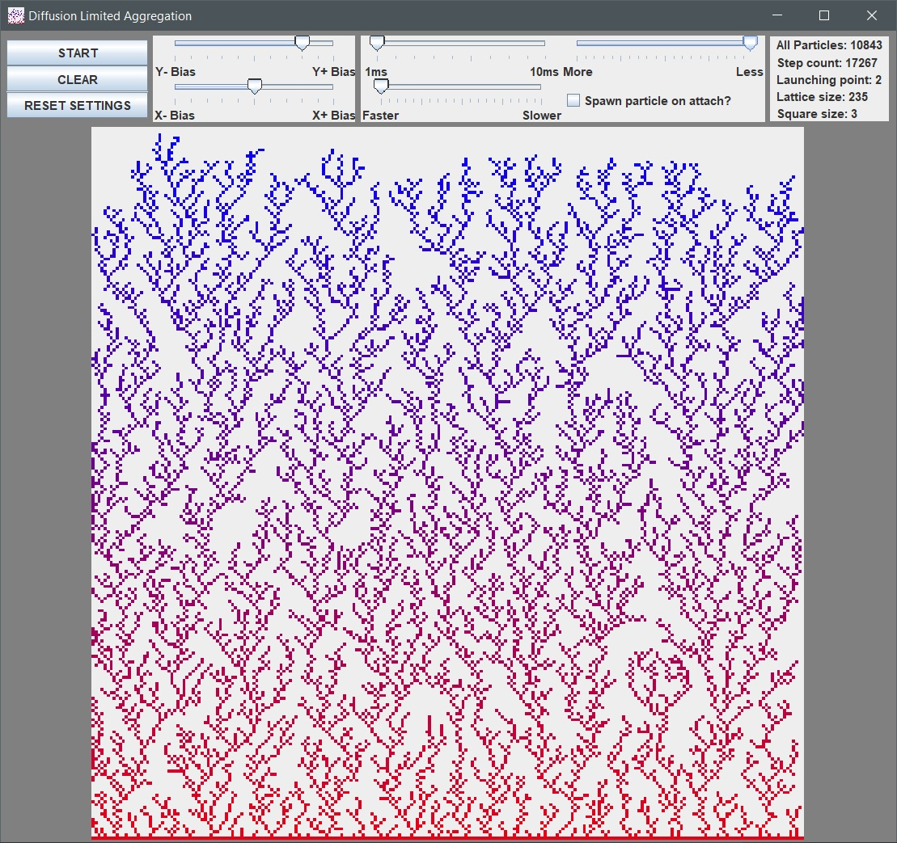

# Diffusion-Limited-Aggregation
A very simple real time simulation of Diffusion Limited Aggregation with a horizontal base, written in Java. Orginally a Computational Physics assigment.

   

## How does it work
- At the very bottom there's a horizontal line of static particles.
- New particles are spawned from the top and advance towards the bottom line (so we assume an initial bias in the Y dimension).
- If any of the spawned (dynamic) particles comes into a contact with a static particle, it also becomes static and stops moving.
- The simulation is stopped when the newly-attached particle reaches the top.

The result is an example of a fractal with a horizontal base.

## Controls

- **X- and X+ Bias** – Control the bias in the X dimension. Simply speaking setting it to the left will make particles change direction to the left more often and vice versa
- **Y- and Y+ Bias** – Same as above, but in Y dimension.
The rest of the settings exist purely to make the simulation faster, as with the default settings you're looking at a long time for it to finish.

- **1ms  10ms** – Change the Thread.sleep(x) value, effectively making the simulation faster. This setting is best left untouched as it puts more strain on the CPU.
- **Faster   Slower** – Change the the counter value in the main step() loop, effectively making the simulation go faster.
- **More   Less** – Change how many particles are in spawned each step.
- **Spawn particle on attach?** – Change whenever an additional particle should be spawned every time one gets attached.

## Usage
Due to assigment requirements all of the code is included in one file. You can either build it yourself or download an executable .jar file from the [Releases](https://github.com/krkjack/Diffusion-Limited-Aggregation/releases/) tab. Ideally you should use JDK9 or higher.

## License
[MIT](https://choosealicense.com/licenses/mit/)
